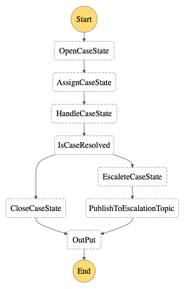

# sync-step-function-from-http-api-cdk
CDK application for HTTP api starting express step function machine synchronously

Synchronous step function is similar to getting started example in [this aws post](https://aws.amazon.com/getting-started/hands-on/create-a-serverless-workflow-step-functions-lambda).



## How to use
1. Install and setup [aws cdk](https://docs.aws.amazon.com/cdk/latest/guide/getting_started.html)
2. run `cdk deploy`
3. Get the base url of http api in console or get in from console.
4. Use postman to send request to url

POST : `<Base url from step 3>/start`

Body: ```{
    "inputCaseID":"002"
}```

